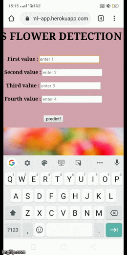

# Iris Species Prediction Web App.

## Flask web app which predicts the species of Iris flower.

You can find a live version of the site [here](https://iris--ml--app.herokuapp.com/)

## Requirements:
1. flask
2. scikit-learn
3. pandas
4. numpy

## Instructions

#### step1:
To run the app locally, enter these commands in your terminal: 

> git clone https://github.com/monu111/Iris-webapp-on-heroku

This downloads the repository from Github to your local machine
#### step2:
> cd Iris-webapp-on-heroku

Change your current working directory to this.
#### step 3:
> pip install pipreqs

> pipreqs                          (in current working directory)

It install the required libraries in your working directiory.

#### step 4
Run the "__app.py__' and tap the address which will be given in the terminal output of your IDE.

### step 5
If anybody wants  to deploy this app to heroku.Then create Procfile file, add this statement given below.which basically  run the app on heroku cloud.After then make a account 
on heruko platform and connect your repo the heroku platform. run this on the platform.

web: gunicorn app:app

### Note: add this requirement given below, in your "requrement.txt" file before deployment.
gunicorn==20.0.4

# Working on it!
